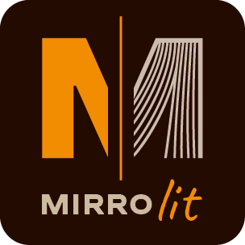
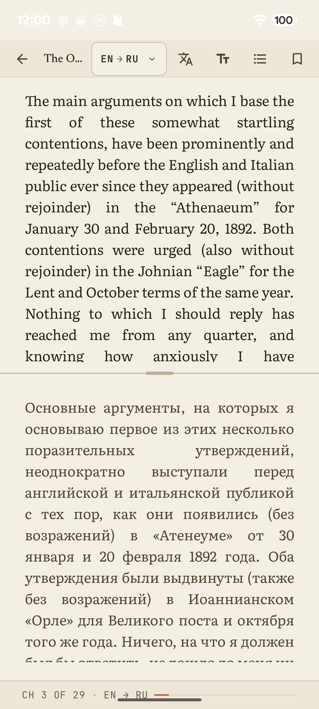
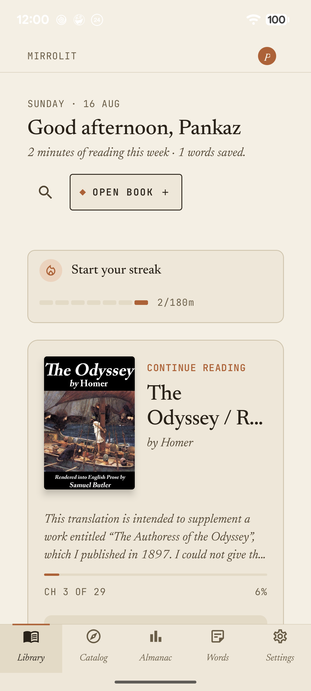
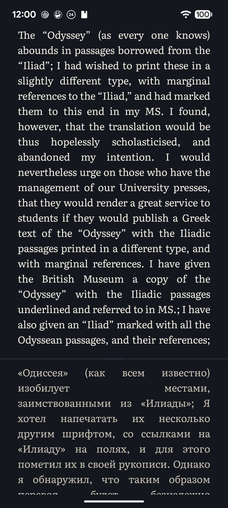

<p align="center">
  
</p>

<h1 align="center">Mirrolit</h1>

<p align="center">
  <b>Read any book in two languages at once.</b><br>
  An Android e-book reader that shows the original text and a live translation side by side.
</p>

<p align="center">
  
  
  
  
</p>

<p align="center">
  
  &nbsp;
  
  &nbsp;
  
</p>

---

Open an EPUB, FB2 or classic MOBI file. Mirrolit detects the source language and translates the book
paragraph by paragraph into the language you pick, right next to the original, so you keep reading
the real text and still understand every line. The default translators run **on the device**, so
nothing you read has to leave your phone.

> The repository and Gradle project are still called *SplitReader* and the source package is
> `com.example.splitreader`. The app ships as **Mirrolit** (`io.mirrolit.app`).

## Features

**Reading**
- EPUB, FB2 and classic MOBI (DRM-protected files and AZW3/KF8 are not supported)
- Split layout: side by side on tablets and in landscape; on phones in portrait the original sits
  above its translation, with a draggable divider and synchronised scrolling
- Inline illustrations for EPUB and FB2
- Four themes (Paper, Sepia, Night, AMOLED), a choice of reading typefaces, and fine typography
  controls: size, line height, paragraph and letter spacing, indent, justification
- Your reading position and bookmarks are kept for every book
- Read aloud with built-in text-to-speech, with adjustable rate and pitch

**Translation**
- Automatic source-language detection (ML Kit Language ID)
- 18 target languages: English, Ukrainian, German, French, Spanish, Italian, Portuguese, Dutch,
  Polish, Chinese, Japanese, Korean, Arabic, Hindi, Turkish, Swedish, Czech, Russian
- Tap a word or drag across a sentence for an instant translation, then save it to your vocabulary
- Translations are cached on the device, so nothing is translated twice

**Library and learning**
- A built-in free catalog of public-domain books from **Project Gutenberg** and **Standard Ebooks**
- Import from device storage or Google Drive
- **Words**: your saved vocabulary, with context
- **Almanac**: reading streak, minutes, a 26-week activity heatmap, and time by book and language
- Reading works without an account; sign-in (email or Google) is optional

## Translation engines

| Engine | Where it runs | Key needed | Notes |
|---|---|---|---|
| **ML Kit** (default) | On device | No | Free, works offline once a language model is downloaded |
| **Offline HQ** | On device | No | Mozilla / Firefox-Translations models run by [bergamot-translator](https://github.com/browsermt/bergamot-translator). Higher quality than ML Kit; each language pair is a 17–44 MB pack downloaded once. Non-English pairs go through English. |
| Quick Translate | Online | No | Unofficial endpoint, best effort |
| DeepL | Online | Your own | |
| Google Cloud Translation | Online | Your own | |
| Microsoft Azure Translator | Online | Your own | |
| LibreTranslate | Online | Your own | Any instance URL, including self-hosted; HTTPS only |

API keys are encrypted with an Android Keystore key and excluded from backups. Online engines only
receive text when you choose one.

## Free and Premium

The library holds up to **3 books** for free. A one-time Google Play purchase unlocks an unlimited
library; there is no subscription. Everything else, including every translation engine, is
available in the free tier.

## Architecture

A single-module app built with Clean Architecture and MVVM:

```
presentation/   Jetpack Compose screens (Material 3) + @HiltViewModel view models, one NavHost
domain/         Pure Kotlin: models, repository interfaces (ports), use cases, book parsers
data/           Room, SharedPreferences, Android Keystore, translators, billing, Offline HQ engine
di/             Hilt modules binding domain ports to data implementations
```

- **The dependency rule is enforced.** `domain/**` imports nothing from `data` or `androidx`, and
  repositories speak domain models; Room entities are mapped at the DAO boundary.
- **Book parsing** is a registry of `BookParser`s picked by priority. EPUB uses Jsoup; FB2 uses a
  pure document builder; MOBI has a hand-rolled PDB + PalmDOC decoder. Reads are size-bounded
  against zip bombs.
- **Offline HQ** is a prebuilt JNI library (arm64-v8a and x86_64) with resumable, hash-verified
  model packs and an LRU of loaded models. See [`docs/offline_hq.md`](docs/offline_hq.md).
- **Domain language** is kept in [`CONTEXT.md`](CONTEXT.md), and architecture decisions are
  recorded in [`docs/adr/`](docs/adr/).

### Tech stack

Kotlin 2.0 · Jetpack Compose (Material 3) · Hilt · Room · Navigation Compose · Coroutines + Flow ·
ML Kit Translate & Language ID · bergamot-translator (JNI) · Retrofit + OkHttp · Jsoup ·
Firebase Auth + Crashlytics · Google Play Billing 8

## Building

Quick start, assuming JDK 17, Android SDK 36 and your own Firebase config:

```bash
git clone https://github.com/p-nk-ss/SplitReader.git
cd SplitReader
# add app/google-services.json from your own Firebase project (package io.mirrolit.app)
./gradlew :app:installDebug
```

`app/google-services.json` is **required** for the build and is not in the repository. Reading and
translation work without signing in; Firebase only powers the optional account and crash reporting.
See **[docs/SETUP.md](docs/SETUP.md)** for the full guide: SDK path, Firebase setup, release signing
and emulator caveats.

## Testing

```bash
./gradlew :app:testDebugUnitTest        # JVM unit tests (JUnit4, Robolectric, hand-written fakes)
./gradlew :app:verifyRoborazziDebug     # screenshot-golden regression suite
./gradlew :app:connectedDebugAndroidTest  # instrumented tests (device or emulator)
```

- **JVM tests** cover the parsers, translation planning, persistence and migrations, the free-tier
  rules, and window insets across the adaptive shell.
- **Screenshot goldens** render the production composables with Roborazzi and live in
  `app/src/test/screenshots/`.
- **The project's test rule:** a new assertion counts only after it has been seen failing for the
  reason it names.
- **Emulator limits:** ML Kit model download and the Project Gutenberg catalog do not work on a
  stock emulator; check those on a real device.

## Project docs

| | |
|---|---|
| [`docs/SETUP.md`](docs/SETUP.md) | Build from a fresh clone |
| [`CONTEXT.md`](CONTEXT.md) | Domain glossary |
| [`docs/adr/`](docs/adr/) | Architecture decision records |
| [`docs/offline_hq.md`](docs/offline_hq.md) | Offline HQ engine: units, pack lifecycle |
| [`docs/test_plan.md`](docs/test_plan.md) | Test backlog |
| [`docs/privacy_policy.md`](docs/privacy_policy.md) | Privacy policy ([hosted version](https://p-nk-ss.github.io/mirrolit-legal/)) |
| [`THIRD_PARTY_LICENSES.md`](THIRD_PARTY_LICENSES.md) | Third-party licences and the MPL-2.0 source offer |

## Status

Version 1.0 is in **internal testing on Google Play**. The UI is English-only for now; full
localization is planned for 1.1.

## License

This repository has no open-source licence yet, so all rights are reserved. Third-party components
keep their own licences; see [`THIRD_PARTY_LICENSES.md`](THIRD_PARTY_LICENSES.md).
